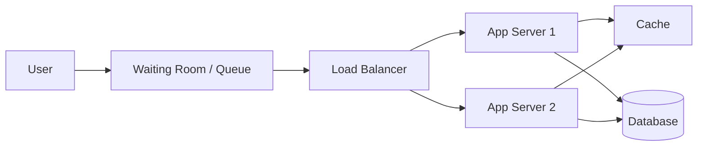

# TicketHub Design Document

## 1. Requirements

### Functional
- Users can browse events.
- Users can view the seats for an event.
- Users can hold a seat for a few minutes.
- Users can pay for the held seat.
- Users can view their tickets.

### Non-functional
- **Speed:** Event pages load in under 1 second, even during a big sale.
- **Correctness:** The same seat must never be sold to two people.
- **Fairness:** First come, first served. Nobody can skip the line.
- **Availability:** The site stays up during a big sale.

## 2. Estimates

| | Normal day | Big sale |
|---|---|---|
| Visitors | 50,000 | 200,000 in 10 minutes |
| Page views | 50,000 x 10 = 500,000/day | ~200,000 people x ~10 requests each = 2,000,000 requests |
| Per second | 500,000 / 86,400 = ~6/sec | 2,000,000 / 600 = ~3,300/sec |
| Purchases | 5,000/day = ~0.06/sec | 20,000 seats / 600 sec = ~33/sec |

**Comparison:** The big sale is about 500x busier for browsing (3,300 vs 6 per second) and about 500x busier for buying (33 vs 0.06 per second). About 10 people compete for every seat (200,000 / 20,000), so the design must handle many people fighting for the same seats.

## 3. API

| Endpoint | Send in | Get back |
|---|---|---|
| `GET /events` | optional filters (date, city) | list of events |
| `GET /events/{id}/seats` | event id | list of seats and their status |
| `POST /seats/{id}/hold` | seat id, user token | success + hold expiry time, or 409 "taken" |
| `POST /orders` | seat id, payment info | order id, confirmation |
| `GET /users/me/tickets` | user token | list of my tickets |

## 4. Data Model

(```sql
users:  id (PK), name, email (UNIQUE)
events: id (PK), name, event_date, venue
seats:  id (PK), event_id (FK -> events.id), seat_label,
        status ('available'/'held'/'sold'),
        held_by (FK -> users.id), hold_expires_at
orders: id (PK), user_id (FK -> users.id),
        seat_id (FK -> seats.id, UNIQUE), paid_at
```

**Relationships:**
- One event has many seats (`seats.event_id` points to `events.id`).
- One user has many orders (`orders.user_id` points to `users.id`).
- One seat can have at most one order (`orders.seat_id` is UNIQUE).
- A seat can be held by one user at a time (`seats.held_by` points to `users.id`)..)

## 5. Preventing Double-Booking

(Two people clicking the same seat at the same time is like two kids grabbing the last cookie. We stop it in four ways:

**1. Atomic update.** Holding a seat is one single database step:

```sql
UPDATE seats
SET status = 'held', held_by = :user, hold_expires_at = now() + interval '5 minutes'
WHERE id = :seat AND status = 'available';
```

If **1 row changed**, you got the seat. If **0 rows changed**, someone else was faster and the API returns "409 seat taken". The database handles two people at once one after the other, so only one can win.

**2. Transaction.** Creating the order and marking the seat as `sold` happen together. If anything fails (for example, payment), everything is undone. It is all or nothing.

**3. UNIQUE constraint.** `orders.seat_id` is UNIQUE, so the database itself refuses to save a second order for the same seat, even if there is a bug in our code.

**4. Hold timer.** A held seat is released after 5 minutes if the person doesn't pay, so seats don't stay stuck..)

## 6. Architecture



(**What each box does:**

- **User:** The person on their phone or computer who wants a ticket.
- **Waiting Room / Queue:** During the big sale, it lets people in a few at a time, in the order they arrived. This keeps the system from being crushed by 200,000 people at once and keeps things fair.
- **Load Balancer:** Sends each request to a different app server so no single server gets overloaded.
- **App Servers:** Run the shop's logic (list events, hold seats, create orders). We can add more of them when traffic grows.
- **Cache:** Stores answers to common questions, like the event list and event details, so we don't ask the database every time. This makes pages fast.
- **Database:** The master notebook. It stores users, events, seats and orders, and it is the only place that decides who really gets a seat.

**How it survives the big sale:**
1. **More cashiers:** We add more app servers behind the load balancer to handle about 3,300 requests per second.
2. **Caching:** Event pages are the same for everyone, so the cache serves them and the database is left free for seat holds and payments.
3. **Queue:** It limits how many people reach the buying step at once, so the database only handles the ~33 purchases per second it can manage.
4. **Database does the final check:** Even with many servers, the atomic update and UNIQUE constraint from Part 5 make sure a seat is never sold twice..)

## 7. Trade-offs

1. (1. **Queue: fairness vs. waiting.** A waiting room is fair and protects the database, but people must wait, and some may get frustrated and leave.
2. **Cache: speed vs. fresh data.** A cache makes seat maps load fast, but the information may be a few seconds old, so a seat shown as available might already be taken. That is why the final check always happens in the database.
3. **Hold time: fairness vs. pressure.** A short 5-minute hold frees seats quickly for others, but it rushes the buyer. A long hold is kinder to the buyer but can lock seats away from other people.)
2. 